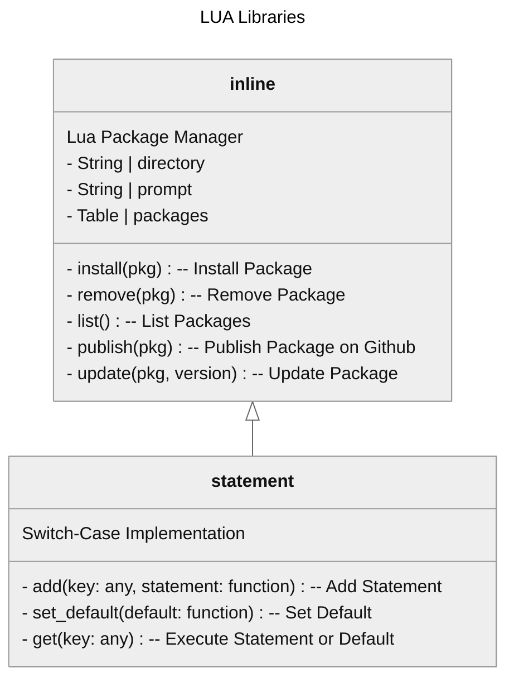

```mermaid
---
title: LUA Libraries
displayMode: compact
config:
  theme: neutral
---

classDiagram
    inline <|-- statement

    class statement {
    Switch-Case Implementation
      - add(key: any, statement: function) -- Add Statement
      - set_default(default: function) -- Set Default
      - get(key: any) -- Execute Statement or Default
    }
    
    class inline {
    Lua Package Manager
      - String | directory
      - String | prompt
      - Table | packages
      - install(pkg) -- Install Package
      - remove(pkg) -- Remove Package
      - list() -- List Packages
      - publish(pkg) -- Publish Package on Github
      - update(pkg, version) -- Update Package
    }
```